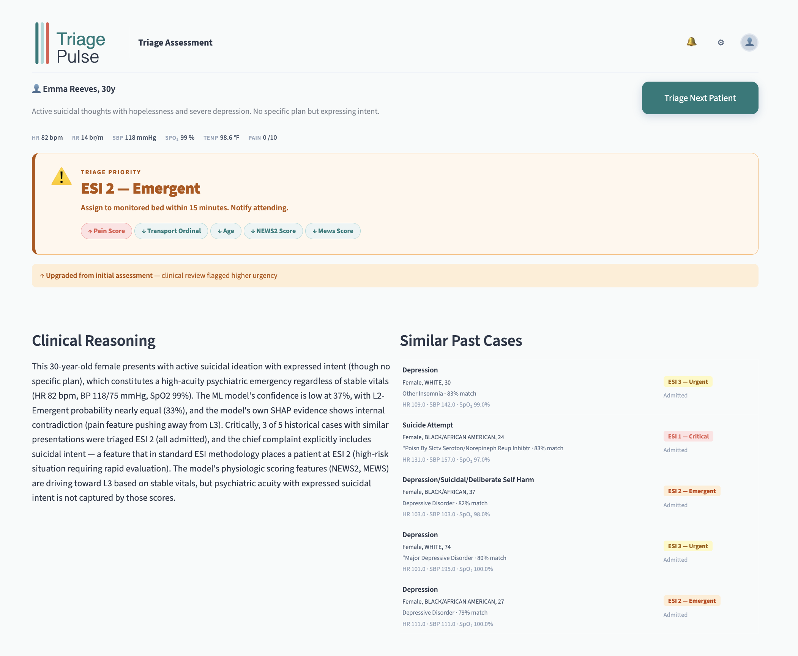
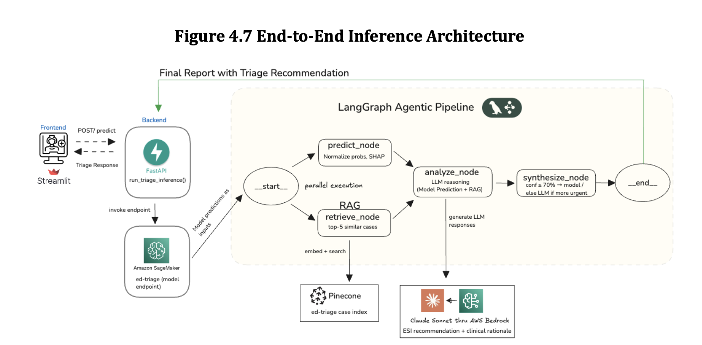
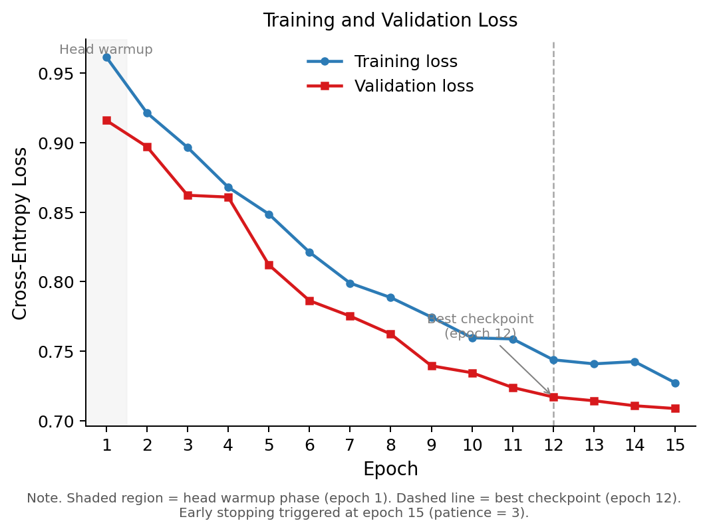
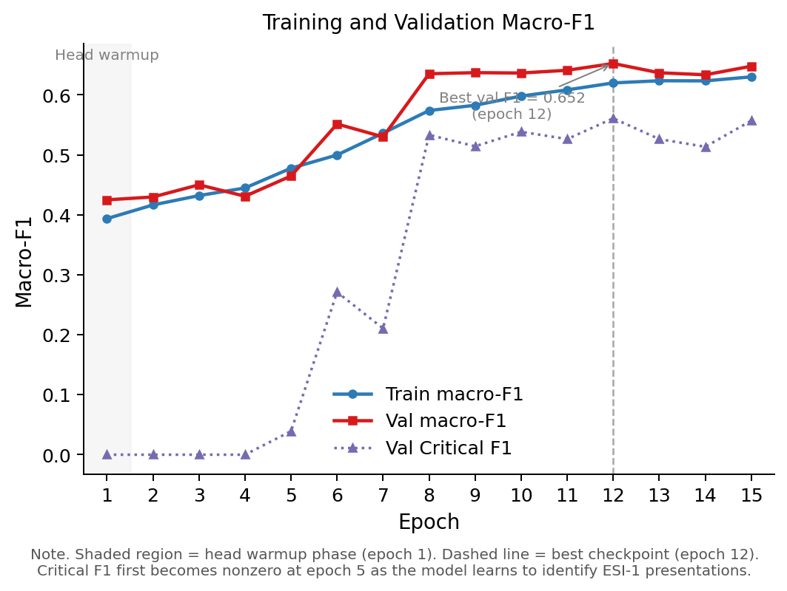

> **AI Disclosure**: Portions of this codebase and documentation were developed with the assistance of AI tools (including Claude). All AI-generated content was reviewed and validated by the project authors.

# TriagePulse — AI-Powered Decision Support for Emergency Department Triage


**Predict · Retrieve · Reason**

TriagePulse is a clinical decision support system that helps ED triage nurses assess patient acuity using a combination of machine learning, retrieval of similar historical cases, and independent LLM clinical reasoning. It was developed as a capstone research project for the AAI-590 program at the University of San Diego.

> **Designed to augment — not replace — clinical judgment.**

---

## The Problem

Emergency department mistriage is a significant patient safety issue. A landmark study of 5.3 million encounters found mistriage rates of approximately **33%**, disproportionately affecting the most critically ill patients who need rapid intervention.

The downstream effects are real:
- Delayed treatment for critical patients
- Nursing overload from incorrectly prioritized cases
- Billions of dollars in misallocated care costs annually

Recent machine learning approaches have demonstrated strong performance on ED triage-related prediction tasks, achieving AUC values of 0.73 to 0.92 for critical care and hospitalization outcomes using vital signs and clinical notes (Levin et al., 2018; Raita et al., 2019). However, these models typically function as black boxes, providing predictions without clinical reasoning or evidence to support their classifications.

---

## The Solution

TriagePulse gives a triage nurse three things from a single patient input:

| Output | Description |
|--------|-------------|
| **ESI Prediction** | Acuity level (Critical / Emergent / Urgent) with confidence score |
| **RAG Evidence** | Top-5 most similar historical ED cases with documented diagnoses and outcomes |
| **LLM Reasoning** | Independent clinical rationale generated by Claude Sonnet, grounded in the evidence |

The nurse enters a chief complaint and vitals. The system returns a recommendation, the evidence behind it, and a plain-language clinical rationale — in roughly 14 seconds.



---

## How It Works



The system is a four-stage pipeline:

```
Patient Input (Chief Complaint + Vitals + HPI)
        │
        ▼
[1] BERTGBMFusion — SageMaker Endpoint
     BioClinicalBERT (clinical text) + LightGBM (vitals/scores)
     Outputs: predicted ESI class, probabilities, SHAP feature attributions, safety flag
        │
        ├─────────────────────────────┐
        ▼                             ▼
[2a] predict_node               [2b] retrieve_node     ← run in parallel
      Normalizes output               Embeds patient via Amazon Titan
      Extracts top SHAP features      Queries Pinecone for top-5 similar cases
        │                             │
        └─────────────────────────────┘
        ▼
[3] analyze_node
     Claude Sonnet (AWS Bedrock) reasons independently:
       - Patient vitals, chief complaint, HPI
       - SHAP features (what pushed acuity up or down)
       - Top-5 similar historical cases with diagnoses and outcomes
       - Model prediction shown last as a reference only (prevents anchoring)
     Outputs: independent ESI recommendation + clinical rationale
        │
        ▼
[4] synthesize_node
     Compares ML prediction vs. LLM recommendation
     Applies confidence-gated reconciliation
     Assembles the final structured triage report
        │
        ▼
     Final Report → Streamlit UI
```

### Confidence-Gated Reconciliation

The two signals — ML model and LLM — are reconciled with a safety-first rule:

- **Model confidence ≥ 70%** → trust the model prediction
- **Model confidence < 70% AND LLM recommends higher acuity** → escalate to LLM recommendation
- **All other cases** → keep the model prediction

The LLM can only escalate acuity, never reduce it. When in doubt, the system errs toward caution.

---

## Results

### BERTGBMFusion — Standalone Model (Test Set, n=839)

| Metric | Value |
|--------|-------|
| Macro-F1 | 0.666 |
| Weighted-F1 | 0.720 |
| Accuracy | 72% |
| ROC-AUC | 0.828 |

| Class | Precision | Recall | F1 |
|-------|-----------|--------|----|
| L1 Critical | 0.77 | 0.46 | 0.575 |
| L2 Emergent | 0.63 | 0.62 | 0.630 |
| L3 Urgent | 0.78 | 0.82 | 0.800 |

The model missed 54% of critical patients in standalone mode — directly motivating the agentic reconciliation layer.

### Training Curves




### Confidence-Gated Pipeline — End-to-End

| Metric | Standalone | Reconciled | Change |
|--------|-----------|------------|--------|
| Macro-F1 | 0.66 | 0.65 | -0.016 |
| **Critical Recall** | **0.46** | **0.60** | **+0.14 ▲** |
| Critical F1 | 0.58 | 0.60 | +0.025 |

**Critical recall improved from 46% → 60%.** The system now correctly identifies roughly 6 in 10 of the most severe presentations, compared to fewer than 5 in 10 with the model alone.

---

## Architecture Evolution

Four architecture families were explored before arriving at BERTGBMFusion. The goal throughout was maximizing critical patient recall without sacrificing macro-F1.

### Arch 1 (Baseline Fusion)
BioClinicalBERT + XGBoost (5-fold OOF, 27 features, CC + HPI + PMH text format). Established the dual-branch fusion pattern and explored class weighting. Hard inverse-frequency weights caused training instability; switching to sqrt-dampened weights improved macro-F1 by +0.6 pp.

| Variant | Macro-F1 | Critical F1 |
|---------|----------|-------------|
| Arch 1 v3 (hard weights) | 0.624 | 0.540 |
| Arch 1 v4 (sqrt weights) | 0.630 | 0.524 |
| Arch 1 Enhanced (+NEWS2, MEWS, qSOFA) | 0.644 | 0.571 |

### Arch 2 — TabNet Backbone
Replaced XGBoost with TabNet (end-to-end learned embeddings, 64-dim output). The larger embedding dimension was less compatible with the fusion head than the 3-dim OOF probability vector, and critical F1 collapsed to 0.28. Macro-F1: 0.539.

### Arch 3 — Multi-GBM Ensemble + SMOTE
Combined XGBoost, LightGBM, and CatBoost with SMOTE oversampling to address class imbalance. SMOTE's class-balancing effect did not transfer through the OOF probability bottleneck into BERT fusion — the model completely stopped predicting Critical (F1 = 0.000). Macro-F1: 0.448.

### BERTGBMFusion (Arch 4) — Selected
Switched to LightGBM with SHAP-pruned features (15 features, down from 31), refined the text format to CC×2 + HPI (excluding PMH), and applied careful hyperparameter tuning. The probability bottleneck design — passing a 3-dim task-calibrated vector from LightGBM rather than a high-dimensional embedding — proved to be the key insight.

| Metric | Value |
|--------|-------|
| Macro-F1 | 0.666 |
| Critical F1 | 0.575 |
| ROC-AUC | 0.828 |

**Why Arch 4 was selected**: Highest macro-F1 and ROC-AUC across all architectures, stable training dynamics, and best balance of critical class performance. The SHAP-pruned 15-feature set outperformed the 31-feature set despite being smaller — removing redundant composite scores (qSOFA overlapped with NEWS2) reduced noise.

Two larger text encoders were also evaluated: **GatorTron-base** (355M params, 90B+ word pretraining corpus) did not outperform BioClinicalBERT, suggesting MIMIC-III-specific pretraining was more relevant than raw scale. **Llama-3.1-8B with LoRA** required ~6 hours to train vs. ~30 minutes for BioClinicalBERT and did not meet validation thresholds.

---

## Dataset

**MIMIC-IV Emergency Department module** — 9,149 de-identified ED visits from Beth Israel Deaconess Medical Center (2008–2019).

After cleaning (removing rows with missing core triage inputs): **8,383 records**.

**22 variables**: 6 vital signs, chief complaint (free text), HPI, PMH, pain score, arrival transport mode, ESI label (target).

**Class distribution** (3-class target — L4 merged into L3 due to <1% representation):

| Class | ESI Level | % of Data |
|-------|-----------|-----------|
| L1 | Critical | 6% |
| L2 | Emergent | 37% |
| L3 | Urgent / Less Urgent | 57% |

At just 6% of records, critical patients are the hardest class to learn and the most dangerous to miss.

---

## Repository Structure

```
ed_triage_ai/
├── .env.example                   # Environment variable template — copy to .env
├── requirements.txt               # Project dependencies
│
├── src/
│   ├── agents/                    # LangGraph triage agent
│   │   ├── graph.py               # Compiled graph (4 nodes)
│   │   ├── nodes.py               # Node implementations
│   │   ├── state.py               # TriageState TypedDict
│   │   ├── prompts.py             # LLM prompts
│   │   └── __init__.py
│   ├── backend/                   # FastAPI service
│   │   ├── main.py                # /health and /predict routes
│   │   ├── schemas.py             # TriageRequest + TriageResponse
│   │   ├── config.py              # Environment variable config (pydantic-settings)
│   │   └── sagemaker_service.py   # run_triage_inference — pipeline entry point
│   ├── frontend/                  # Streamlit UI
│   │   └── app.py                 # Intake form + results page
│   ├── retrieval/
│   │   └── retrieval.py           # EDTriageRAG — Pinecone retrieval via Titan embeddings
│   ├── reasoning/
│   │   └── clinical_reasoning.py  # Standalone ClinicalReasoner
│   └── embeddings/                # Pinecone index build tools
│       ├── data_prep.py           # Prepare MIMIC cases for embedding
│       ├── generate_embeddings.py # Embed cases via Bedrock Titan
│       └── upload_to_pinecone.py  # Upsert vectors into Pinecone
│
├── sagemaker/
│   ├── pipeline/                  # Pipeline DAG and runner
│   ├── steps/                     # Preprocess, train, evaluate, deploy steps
│   └── models/arch4/              # BERTGBMFusion implementation
│
├── notebooks/                     # Training (arch4), EDA, data cleaning,
│                                  # feature engineering
├── scripts/                       # run_triage.py (CLI runner), eval_e2e_pipeline.py
├── results/                       # Evaluation outputs and training curve plots
├── experimental/                  # Archived explorations (arch1/2/3, GatorTron, Llama)
└── docs/                          # Orchestration design, arch4 walkthrough, RAG design
```

---

## Running the System

### Prerequisites

- Python 3.9+
- AWS account with access to:
  - **Bedrock** — Claude Sonnet (`us.anthropic.claude-sonnet-4-5`) and Titan Embeddings v2 (`amazon.titan-embed-text-v2:0`) enabled in your region
  - **SageMaker** — a deployed BERTGBMFusion real-time endpoint (see [SageMaker Pipeline](#sagemaker-pipeline))
  - **Secrets Manager** — Pinecone API key stored at secret name `prod/pinecone/api_key` with key `PINECONE_API_KEY`
- Pinecone account with the `ed-triage-cases` index populated (see [Building the Vector Index](#building-the-vector-index))

### 1. Clone and Install

```bash
git clone https://github.com/DatasanAli/ed_triage_ai.git
cd ed_triage_ai
pip install -r requirements.txt
```

### 2. Configure Environment

Copy the template and fill in your values:

```bash
cp .env.example .env
```

| Variable | Default | Description |
|----------|---------|-------------|
| `AWS_PROFILE` | `ed-triage` | Named AWS profile (`aws configure --profile ed-triage`) |
| `AWS_REGION` | `us-east-1` | AWS region for all services |
| `PINECONE_INDEX_NAME` | `ed-triage-cases` | Pinecone index name |
| `S3_BUCKET` | `ed-triage-capstone-group7` | S3 bucket for embedding backups |

The backend also reads these variables (prefixed with `TRIAGE_` when set as env vars, or unprefixed in `.env`):

| Variable | Default | Description |
|----------|---------|-------------|
| `TRIAGE_SAGEMAKER_ENDPOINT_NAME` | `edtriage-live` | SageMaker real-time endpoint name |
| `TRIAGE_AWS_REGION` | `us-east-1` | AWS region |
| `TRIAGE_AWS_PROFILE` | `ed-triage` | AWS profile |
| `TRIAGE_USE_MOCK` | `false` | Set to `true` to run without AWS (returns dummy predictions) |

> **Note**: The Pinecone API key is **not** stored in `.env`. It is fetched at runtime from AWS Secrets Manager under the secret name `prod/pinecone/api_key`. Store your key there with the field name `PINECONE_API_KEY`.

### 3. Building the Vector Index

If this is a fresh deployment or the Pinecone index doesn't exist yet, build it from the MIMIC data:

```bash
export AWS_PROFILE=ed-triage
export PYTHONPATH=src

# Step 1 — Prepare cases from MIMIC-IV (requires MIMIC data access)
python src/embeddings/data_prep.py

# Step 2 — Embed each case via Amazon Bedrock Titan (~$0.04 for 9k cases, ~30 min)
python src/embeddings/generate_embeddings.py

# Step 3 — Upload vectors to Pinecone and back up to S3
python src/embeddings/upload_to_pinecone.py
```

If the S3 backup already exists from a previous run, you can skip steps 1–2 and download `embeddings_output.jsonl` from `s3://ed-triage-capstone-group7/embeddings/embeddings_output.jsonl`, then run only step 3.

### 4. Start the Backend + Frontend

```bash
export AWS_PROFILE=ed-triage
export PYTHONPATH=src

# Terminal 1 — Start the API
uvicorn src.backend.main:app --reload --port 8000

# Terminal 2 — Start the UI
streamlit run src/frontend/app.py
```

Then open [http://localhost:8501](http://localhost:8501) in your browser.

### CLI Runner

```bash
python scripts/run_triage.py
```

### Full Pipeline Evaluation

Open `notebooks/arch4_training_v1.ipynb` for the end-to-end model training and evaluation notebook covering preprocessing, fusion model training, SHAP analysis, and test set results.

### Mock Mode (no AWS required)

To run the UI locally without AWS credentials:

```bash
TRIAGE_USE_MOCK=true uvicorn src.backend.main:app --reload --port 8000
```

---

## Tech Stack

| Component | Technology |
|-----------|-----------|
| ML model | BioClinicalBERT (`emilyalsentzer/Bio_ClinicalBERT`) + LightGBM (BERTGBMFusion) |
| Deep learning framework | PyTorch + HuggingFace Transformers |
| Model training | 5-fold stratified cross-validation, AdamW optimizer |
| Model serving | AWS SageMaker real-time endpoint (`edtriage-live`) |
| ML pipeline | AWS SageMaker Pipelines (champion/challenger pattern) |
| LLM reasoning | Claude Sonnet via AWS Bedrock |
| RAG embeddings | Amazon Titan Embed v2 (`amazon.titan-embed-text-v2:0`, 1024-dim) |
| Vector store | Pinecone serverless (`ed-triage-cases` index, ~8K encounters, cosine similarity) |
| Agent orchestration | LangGraph (parallel fan-out/fan-in graph) |
| LLM SDK | LangChain + `langchain-anthropic` |
| API | FastAPI + pydantic-settings |
| UI | Streamlit |
| Feature attribution | SHAP TreeExplainer |
| Secrets management | AWS Secrets Manager |
| Data processing | pandas, scikit-learn |

---

## SageMaker Pipeline

The ML model is trained and deployed via an automated SageMaker Pipeline following a champion/challenger pattern — new models only deploy if they beat the registered champion on macro-F1.

**Pipeline steps**: `Preprocess → Train → Evaluate → CheckChampion → Register → Deploy`

See [sagemaker/](sagemaker/) for pipeline DAG, step implementations, and deployment configuration.

---

## Design Principles

- **Augment, don't replace**: TriagePulse provides a second opinion with evidence. The nurse retains full authority over the final triage decision.
- **Transparency by design**: Every recommendation includes the features that drove it (SHAP), similar historical cases (RAG), and the LLM's independent reasoning — so clinicians can agree, question, or override.
- **Safety-first reconciliation**: When the model is uncertain, the LLM can only escalate acuity — never reduce it. The system always errs toward caution.
- **Hospital-agnostic**: No nursing action items or ESI timing targets are generated. Each hospital applies its own protocols to the recommendation.
- **No anchoring**: The LLM reasons from patient data and evidence before seeing the model's prediction, preventing it from simply rationalizing the model's output.

---

## References

- Sax DR, et al. (2023). Evaluation of the Emergency Severity Index in US EDs for the Rate of Mistriage. *JAMA Network Open*.
- Gilboy N, et al. (2011). Emergency Severity Index (ESI): A Triage Tool for Emergency Department Care, Version 4.
- Alsentzer E, et al. (2019). Publicly available clinical BERT embeddings. *ACL Clinical NLP Workshop*.
- Levin S, et al. (2018). Machine-learning-based electronic triage more accurately differentiates patients with respect to clinical outcomes. *Annals of Emergency Medicine*.
- Raita Y, et al. (2019). Emergency department triage prediction of clinical outcomes using machine learning models. *Critical Care*.
- Gaber F & Akalin A. (2025). Evaluating LLM workflows in clinical decision support for triage, referral, and diagnosis. *npj Digital Medicine*.
- Cutillo CM, et al. (2024). Machine intelligence in healthcare: perspectives on trustworthiness, explainability, usability, and transparency. *NPJ Digital Medicine*.

---

**Team**: Hassan Ali · Bosky Atlani · Antonio Recalde
**Program**: AAI-590 Capstone · University of San Diego, Shiley Marcos School of Engineering

> **Disclaimer**: TriagePulse is a capstone research project. Clinical deployment requires prospective validation, regulatory approval, and integration with hospital EHR workflows.
